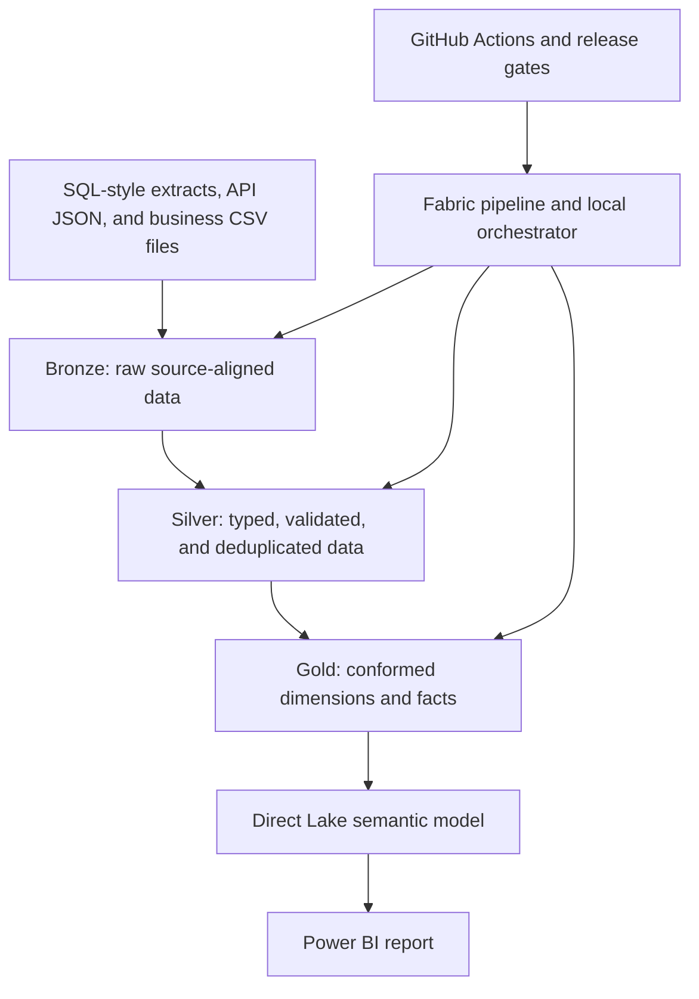

# Fabric Modern Data Platform

## Project Summary

This repository demonstrates an end-to-end, production-shaped Microsoft Fabric lakehouse platform for Commercial Real Estate operations and finance analytics.

The completed seven-phase project demonstrates:

- SQL-style, REST API-style, and business-file ingestion
- Bronze, Silver, and Gold medallion architecture
- Standard audit columns and raw-record hashing
- Configuration-driven data contracts
- Data validation, quarantine, and full-key deduplication
- Power BI-ready dimensional modeling
- Direct Lake semantic-model design and governed DAX measures
- Dependency-aware orchestration, retry handling, and audit logging
- Automated testing and GitHub Actions validation
- Dev/Test/Prod release gates, packaging, and rollback planning

The repository contains two complementary implementations:

1. **Local Python/pandas execution** for learning, unit testing, CI, and demonstration without requiring a Fabric capacity.
2. **Fabric PySpark/Delta implementations and build specifications** for deployment into a schema-enabled Fabric Lakehouse.

## Business Scenario

A Commercial Real Estate company manages properties, tenants, leases, rent payments, maintenance requests, monthly budgets, business regions, and external weather observations.

The platform supports trusted analysis of:

- Rent collections and outstanding balances
- Lease portfolio and contracted rent
- Property and tenant activity
- Maintenance volume, cost, and resolution time
- Property budgets and budget-versus-actual performance
- Portfolio performance by property, market, and region
- Data quality and pipeline health

## Architecture



### Fabric Target Architecture

| Layer | Fabric implementation | Responsibility |
|---|---|---|
| Ingestion | Fabric notebooks and Data Pipeline | Read sources, coordinate activities, propagate run IDs |
| Bronze | Managed Delta tables in `bronze` | Preserve raw records and ingestion lineage |
| Silver | Managed Delta tables in `silver` | Standardize, validate, quarantine, and deduplicate |
| Gold | Managed Delta tables in `gold` | Publish dimensions, facts, keys, and business measures |
| Semantic | Power BI Direct Lake semantic model | Relationships, DAX, formatting, and governed consumption |
| Operations | Pipeline logs, metrics, health report, runbooks | Monitoring, diagnosis, recovery, and audit evidence |
| Delivery | GitHub Actions or Azure DevOps plus Fabric deployment pipelines | Validate, approve, package, promote, and roll back |

## Technologies

- Microsoft Fabric Lakehouse and OneLake
- Microsoft Fabric notebooks and Data Pipelines
- Delta Lake and PySpark
- Python and pandas
- SQL and Lakehouse SQL analytics endpoint
- Power BI and DAX
- Direct Lake semantic models
- Git and GitHub
- GitHub Actions
- Azure DevOps pipeline template
- pytest

## Data Sources

| Source | Type | Description |
|---|---|---|
| `properties` | CSV simulating SQL extraction | Property master data |
| `tenants` | CSV simulating SQL extraction | Tenant master data |
| `leases` | CSV simulating SQL extraction | Lease contracts |
| `rent_payments` | CSV simulating SQL extraction | Rent payment transactions |
| `maintenance_requests` | CSV simulating SQL extraction | Property maintenance operations |
| `property_budget` | Business CSV | Property-level monthly budgets |
| `property_region_mapping` | Reference CSV | Region and market enrichment |
| OpenWeather sample | REST API-style JSON | Weather enrichment example without committed credentials |

## Medallion Architecture

### Bronze

Bronze preserves source-aligned records and adds standardized audit metadata:

- `source_system`
- `source_object`
- `source_file_name`
- `ingestion_timestamp`
- `pipeline_run_id`
- `load_type`
- `raw_record_hash`

Local Bronze outputs include:

- `bronze_properties.csv`
- `bronze_tenants.csv`
- `bronze_leases.csv`
- `bronze_rent_payments.csv`
- `bronze_maintenance_requests.csv`
- `bronze_property_budget.csv`
- `bronze_property_region_mapping.csv`
- `bronze_weather_api_raw.jsonl`

### Silver

Silver applies configuration-driven processing:

- Snake-case column normalization
- Blank-to-null standardization
- Data-type casting
- Required-field validation
- Numeric and date-order checks
- Record-level rejection reasons
- Latest-record-wins deduplication using complete business keys
- Bronze lineage preservation

Valid local outputs are written to `data/silver/`; rejected records are written to `data/rejected/`. The Fabric notebook writes Delta tables to `silver` and rejected data to `silver_quarantine.rejected_records`.

The monthly budget grain is explicitly defined as:

```text
property_id + budget_month
```

This preserves all property-month records rather than incorrectly collapsing them to one record per property.

### Gold

Gold publishes a tested star schema.

**Dimensions**

- `dim_property`
- `dim_tenant`
- `dim_date`

**Facts**

- `fact_lease`
- `fact_rent_payment`
- `fact_maintenance_request`
- `fact_property_budget`

The model implements deterministic surrogate keys, key `0` unknown members, conformed dimensions, declared fact grains, date keys, and relationship validation.

Budget calculations use the actual source contract:

```text
budget_revenue = budgeted_rent
budget_expense = budgeted_maintenance + budgeted_operating_expense
budget_noi = budget_revenue - budget_expense
```

## Power BI Semantic Model

The version-controlled semantic contract defines:

- Seven Gold tables
- Twelve one-to-many relationships
- Active primary-date relationships
- Inactive lease-end and maintenance-completion relationships
- Governed DAX measures
- Hidden technical fields
- Measure formatting
- Direct Lake decision guidance
- Security and RLS design notes

Planned report implementation:

1. Executive Overview
2. Rent Collections
3. Lease Portfolio
4. Maintenance Operations
5. Budget Versus Actual
6. Data Quality

Follow `powerbi/semantic-model/build-guide.md` to create the semantic model and report in Fabric.

## Orchestration and Observability

`pl_cre_end_to_end` coordinates:

The SQL, API, and file Bronze activities must all succeed before Silver runs. Silver is followed by Gold, semantic validation, and unit tests.

The orchestration framework includes:

- Dependency validation
- Shared pipeline run IDs
- Bounded API retries
- Execution timeouts
- Failure propagation and downstream skipping
- Pipeline- and step-level JSONL audit logs
- Captured status, attempt, duration, return code, and bounded error details
- Operations health reporting

The local runner mirrors the Fabric activity graph. `pipelines/fabric-pipeline-manifest.json` is a logical build specification, not an exported Fabric deployment definition.

## Testing and Validation

Automated tests cover:

- Stable raw-record hashes
- Bronze audit columns
- Silver casting, validation, quarantine, and full-key deduplication
- Gold surrogate keys, unknown members, grain, and calculations
- Semantic-model table and relationship contracts
- DAX measure inventory
- Orchestration retries, failures, and skipped dependencies
- Release validation, evidence gates, and checksummed packaging

SQL acceptance queries provide deployed-table checks through the Lakehouse SQL analytics endpoint.

Run all tests with:

```powershell
python -m pytest
```

## Dev/Test/Prod Delivery

| Stage | Workspace | Lakehouse | Schedule |
|---|---|---|---|
| Development | `ws-cre-modernization-dev` | `lh_cre_dev` | Disabled |
| Test | `ws-cre-modernization-test` | `lh_cre_test` | Disabled |
| Production | `ws-cre-modernization-prod` | `lh_cre_prod` | Enabled after validation |

The delivery model uses:

- Git and pull requests as the source-control workflow
- GitHub Actions as the primary CI implementation
- An Azure DevOps staged-pipeline equivalent
- Fabric deployment pipelines for workspace artifact promotion
- Environment-specific deployment rules
- Protected Test and Production approvals
- Versioned, checksummed release packages
- Post-deployment validation and rollback runbooks

## Repository Structure

- `.github/workflows/`: repository, end-to-end, and release automation
- `architecture/`: architecture and source-to-target documentation
- `config/`: source, Silver, Gold, semantic, pipeline, and environment contracts
- `data/`: committed samples and ignored generated outputs
- `deployment/`: promotion rules, checklists, Azure pipeline, and rollback
- `docs/`: phase guides, operations guidance, and case-study material
- `notebooks/`: local phase runners and Fabric PySpark/Delta implementations
- `pipelines/`: Fabric pipeline design manifest
- `powerbi/`: semantic model, DAX, report design, and theme
- `scripts/`: release validation, gates, and packaging
- `sql/`: DDL and acceptance queries
- `src/`: reusable ingestion, transformation, orchestration, and deployment logic
- `tests/`: unit and contract tests

## Quick Start

### 1. Create the environment

From the repository root:

```powershell
python -m venv .venv
.\.venv\Scripts\Activate.ps1
python -m pip install --upgrade pip
python -m pip install -r requirements.txt
```

### 2. Run the complete local platform

```powershell
python notebooks/07_run_end_to_end_pipeline.py
```

This executes all ingestion and transformation phases, semantic validation, and unit tests.

### 3. Review operational health

```powershell
python notebooks/08_pipeline_health_report.py
```

Generated outputs are written beneath:

```text
data/bronze/
data/silver/
data/rejected/
data/gold/
data/operations/
```

These directories represent local execution output and should remain ignored by Git.

## Phase-by-Phase Execution

### Phase 1: Repository Foundation

Review the structure, sample data, configuration, starter utilities, documentation, tests, and GitHub Actions workflow.

### Phase 2: Bronze Ingestion

```powershell
python notebooks/01_bronze_sql_ingestion.py
python notebooks/02_bronze_api_ingestion.py
python notebooks/03_bronze_file_ingestion.py
```

### Phase 3: Silver Transformations

```powershell
python notebooks/04_silver_transformations.py
python -m pytest
```

### Phase 4: Gold Dimensional Model

```powershell
python notebooks/05_gold_dimensional_model.py
python -m pytest
```

### Phase 5: Power BI Semantic Model

```powershell
python notebooks/06_validate_semantic_model.py
python -m pytest
```

Expected validation result:

```json
{
  "model_name": "CRE Portfolio Analytics",
  "passed": true
}
```

### Phase 6: Orchestration and Observability

```powershell
python notebooks/07_run_end_to_end_pipeline.py
python notebooks/08_pipeline_health_report.py
```

### Phase 7: Dev/Test/Prod Deployment

```powershell
python scripts/validate_release.py --environment dev
python scripts/check_deployment_gates.py --environment dev --write-evidence
python scripts/create_release_package.py --version 1.0.0
```

Generated releases are written to `dist/` and should not be committed.

## Implemented Versus Extension Scope

### Implemented

- Local multi-source ingestion using committed sample data
- Raw API JSON preservation
- Audit metadata and raw hashes
- Silver data-quality and quarantine framework
- Gold star-schema generation and validation
- Semantic-model contract and DAX library
- End-to-end orchestration and operational logging
- CI, release gates, packaging, and deployment documentation
- Fabric PySpark/Delta notebook implementations

### Recommended production extensions

- Connect to a secured live SQL or Azure SQL source
- Implement a transactional watermark with Delta `MERGE`
- Add live API authentication, pagination, and rate-limit handling
- Add Excel ingestion when required by a real source contract
- Add a governed user-to-property security bridge and RLS
- Add Fabric-native alerting and an operational monitoring dashboard
- Add performance testing for Spark partitioning, file sizing, and Direct Lake behavior
- Add Type 2 dimensions only where historical attribute reporting is required

## Documentation

- Architecture and layer guides: `architecture/` and `docs/`
- Power BI implementation: `powerbi/semantic-model/build-guide.md`
- Operations: `docs/operations-runbook-phase-6.md`
- Dev/Test/Prod promotion: `deployment/dev-test-prod-guide.md`
- Rollback: `deployment/rollback-runbook-phase-7.md`
- Interview preparation: `docs/interview-talking-points.md`
- Lessons learned: `docs/lessons-learned.md`

## Project Status

All seven repository phases are implemented. The next milestone is provisioning the documented Fabric resources, running the PySpark/Delta notebooks in a Development workspace, creating the Direct Lake semantic model and report, and capturing deployment and portfolio screenshots.
