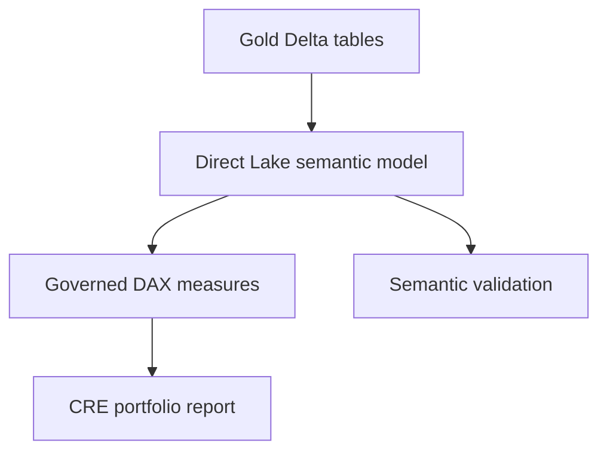

# Phase 5: Power BI Semantic Model

## Objective

Turn the Gold star schema into a governed Power BI semantic model with explicit relationships, reusable DAX measures, consistent formatting, a report design, and automated pre-deployment checks.

## Architecture



## Deliverables

- Version-controlled semantic-model contract
- Twelve one-to-many relationship definitions
- Active and inactive role-playing date relationships
- Governed DAX measure library
- Measure formatting catalog
- Six-page report design
- Power BI theme
- Direct Lake decision record
- Security design notes
- Local semantic validation script and unit tests
- SQL reconciliation queries

## Senior-Level Practices

**Thin semantic model:** Transformations and reusable row-level calculations live in Gold; DAX handles filter-context-dependent aggregations.

**Explicit measure ownership:** Report authors use governed measures instead of implicit column sums.

**Single-direction star relationships:** Dimensions filter facts without ambiguous bidirectional paths.

**Role-playing dates:** Primary date relationships remain active; secondary dates use inactive relationships and `USERELATIONSHIP` measures.

**Deployment gate:** The model contract is validated against the physical Gold outputs before publication.

## Local Run

Run Phase 4 first, then:

```powershell
python notebooks/06_validate_semantic_model.py
python -m pytest
```

Review:

```text
data/gold/semantic_model_validation.json
```

## Completion Checkpoint

- Semantic validation returns `passed: true`.
- Seven Gold tables are present in the Direct Lake model.
- All relationships match the configuration.
- The date table and sort properties are configured.
- Required DAX measures exist and match SQL spot checks.
- Technical fields are hidden and measures are formatted.
- Report pages render correctly under common filters.
- Model and report are saved in the Development workspace.
