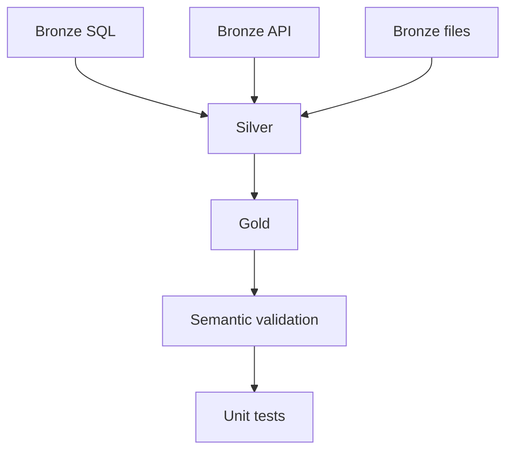

# Phase 6: Orchestration and Observability

## Objective

Coordinate the full data platform as one dependency-aware workflow and produce operational evidence for every pipeline and activity attempt.

## Execution Flow



The three ingestion branches are independent in Fabric and converge only after all succeed. The local runner executes them sequentially for portability but enforces the same dependency contract.

## Audit Contract

### Pipeline run log

`data/operations/pipeline_runs.jsonl` records:

- Pipeline name and run ID
- Start and completion timestamps
- Final status and duration
- Succeeded, failed, and skipped step counts

### Step attempt log

`data/operations/pipeline_step_runs.jsonl` records:

- Pipeline run ID and step name
- Attempt number
- Status, return code, and duration
- Bounded stdout and error details

Every Bronze record receives the orchestrator's `pipeline_run_id`, connecting data lineage to the operational logs.

## Retry Policy

Only the API ingestion step retries automatically because transient HTTP failures are plausible. Deterministic transformation, schema, and validation failures are not retried; they require correction or controlled reprocessing.

## Local Execution

```powershell
python notebooks/07_run_end_to_end_pipeline.py
python notebooks/08_pipeline_health_report.py
```

The runner uses the active Python interpreter, so the project virtual environment remains in effect.

## Fabric Translation

Use `pipelines/fabric-pipeline-manifest.json` as the build specification for a Fabric Data Pipeline. Replace local script activities with Fabric Notebook activities, pass `environment` and `pipeline_run_id` parameters, and configure failure logging on failed or skipped dependencies.

The manifest is a platform-neutral design artifact, not an exported Fabric deployment definition.

## Completion Checkpoint

- The end-to-end local pipeline succeeds.
- All Bronze outputs share one pipeline run ID.
- Pipeline and step JSONL logs are created.
- The health report shows the latest successful run.
- A forced test failure skips dependent steps and records the error.
- GitHub Actions runs the end-to-end workflow successfully.
- The Fabric pipeline is configured with equivalent dependencies and retry behavior.
