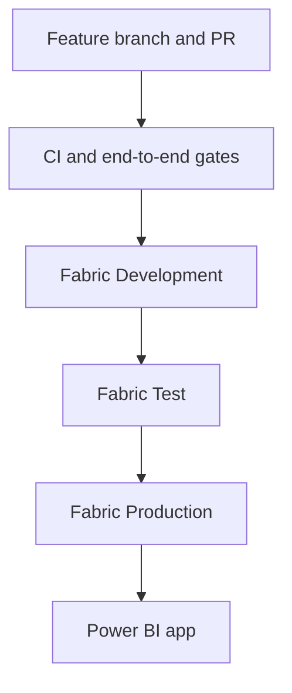

# Phase 7: Dev/Test/Prod Deployment and CI/CD

## Objective

Complete the project with a controlled promotion process that produces immutable release evidence, separates environment configuration, requires validation and approvals, supports rollback, and keeps credentials out of Git.

## Delivery Model



Git is the source of truth for code and configuration. Fabric deployment pipelines promote workspace artifacts. GitHub or Azure DevOps environments provide approval and release evidence.

## Automated Gates

- Repository structure and environment configuration
- Secret-file detection
- Full Bronze-to-semantic execution
- Unit tests
- Latest pipeline-run success
- Nonempty, unique-grain Gold models
- Successful semantic-model validation
- Checksummed release manifest

## Release Package

Create a local release after a successful end-to-end run:

```powershell
python scripts/validate_release.py --environment dev
python scripts/check_deployment_gates.py --environment dev --write-evidence
python scripts/create_release_package.py --version 1.0.0
```

The resulting archive in `dist/` contains only approved repository paths and includes a SHA-256 checksum for every file.

## Platform Options

`.github/workflows/release.yml` is the primary implementation because the repository already uses GitHub Actions. `deployment/azure-pipelines.yml` demonstrates the equivalent Azure DevOps staged workflow and environment approvals.

Neither template commits credentials. Platform authentication should use a managed identity, workload identity federation, or environment-protected service principal when automated Fabric deployment is introduced.

## Completion Checkpoint

- Dev/Test/Prod workspaces and Fabric deployment stages exist.
- Development is connected to the approved Git branch.
- Deployment rules bind each stage to its own Lakehouse.
- GitHub environments and reviewers are configured.
- A versioned release package is generated successfully.
- Test and Production promotions follow the checklist.
- Rollback has been rehearsed with a prior version.
- Production validation and release evidence are retained.
